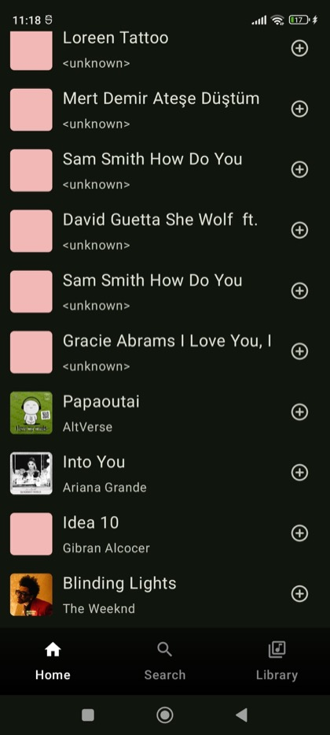
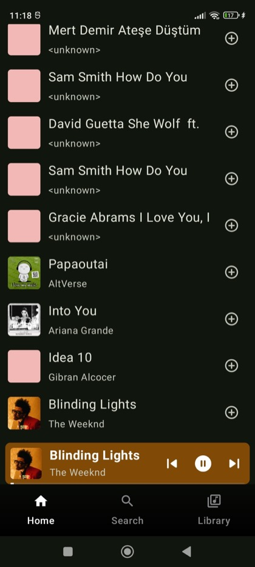
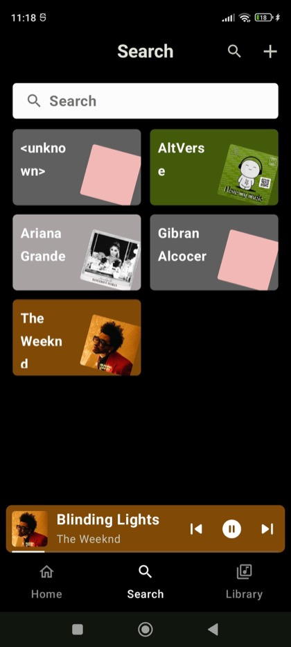
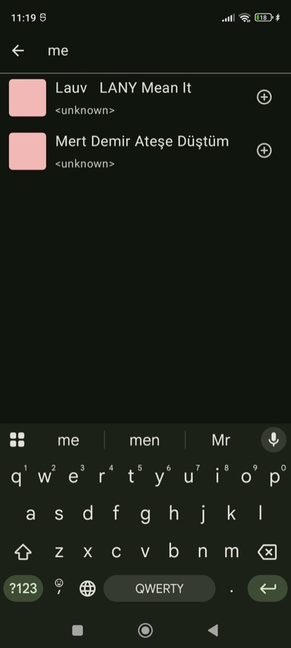
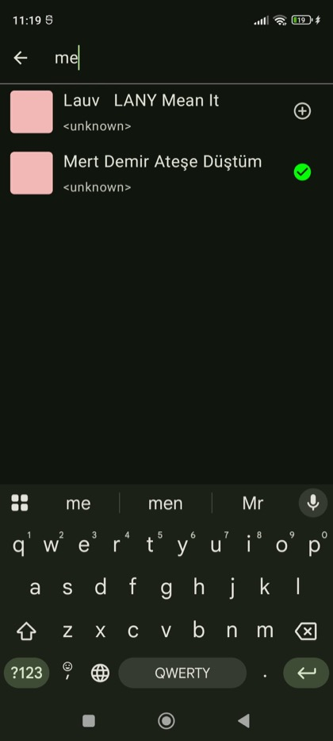
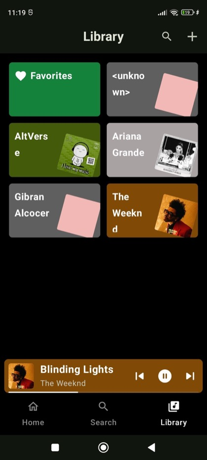
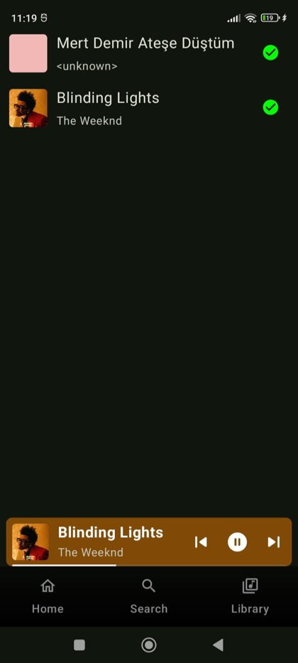
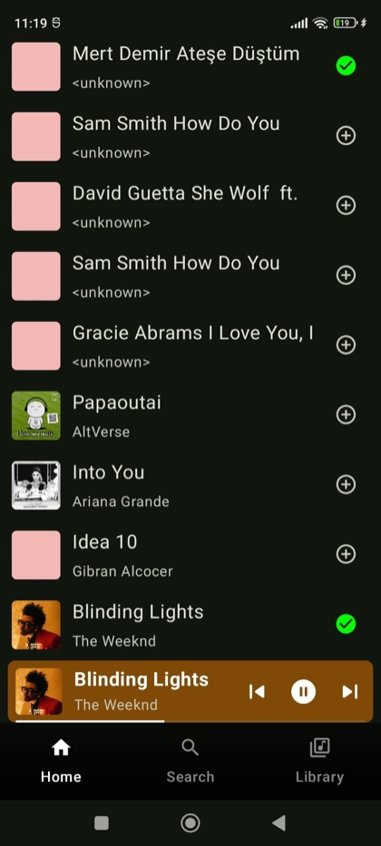
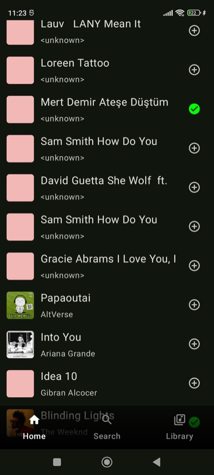

# Spotify — Android Music Player

A local Android music player with a Spotify-inspired interface.

The application scans music stored on the device, organizes it by artist, supports favorites and search, and provides background playback with a mini player and a full-screen player.

## Interface / Интерфейс

### Home and playback / Главный экран и воспроизведение

| Local library | Mini player | Full-screen player |
|:---:|:---:|:---:|
|  |  |  |
| Треки, обложки, исполнители и избранное | Прогресс и быстрые команды воспроизведения | Обложка, данные трека, перемотка и управление |

### Search / Поиск

| Artist overview | Live search | Search actions |
|:---:|:---:|:---:|
|  |  |  |
| Карточки исполнителей с обложками и динамическими цветами | Фильтрация медиатеки по названию во время ввода | Воспроизведение и управление избранным из результатов |

### Library and favorites / Медиатека и избранное

| Library | Favorites | Favorite state |
|:---:|:---:|:---:|
|  |  |  |
| Favorites и группы исполнителей | Сохранённые композиции с синхронизацией через Room | Единое состояние избранного на связанных экранах |

### Scrolling library / Прокрутка медиатеки

Длинный список локальных треков с постоянным доступом к нижней навигации и состоянию воспроизведения.

## Documentation

- [English](README_EN.md)
- [Русский](README_RU.md)
